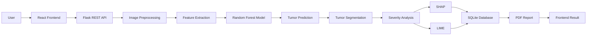
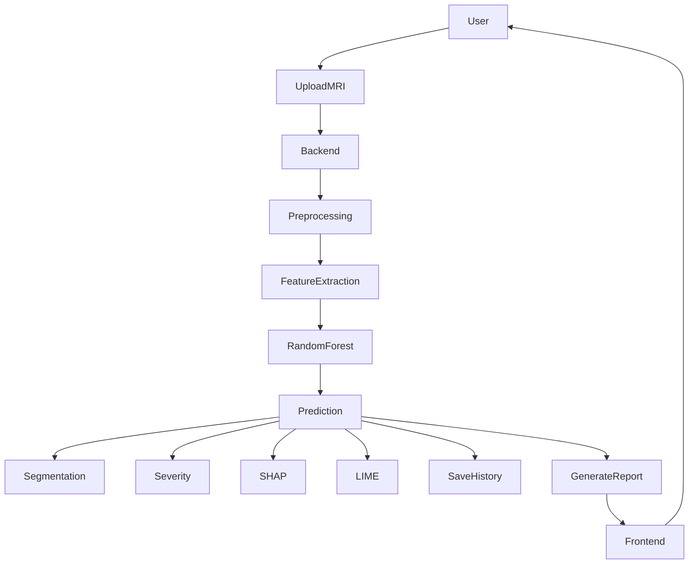
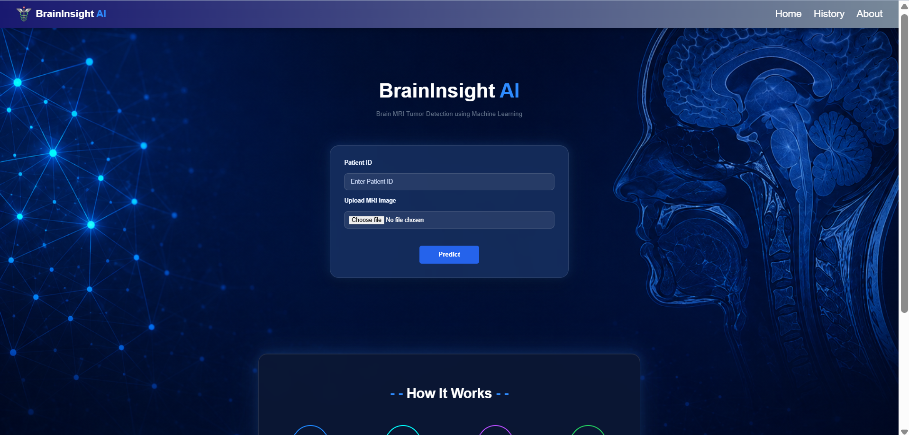
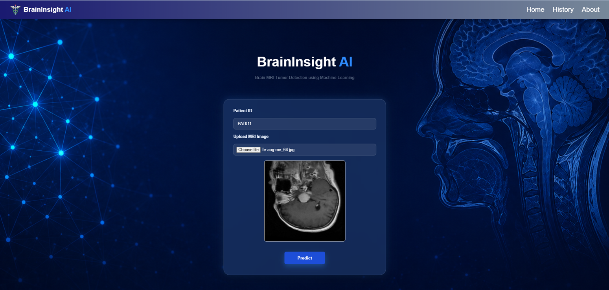
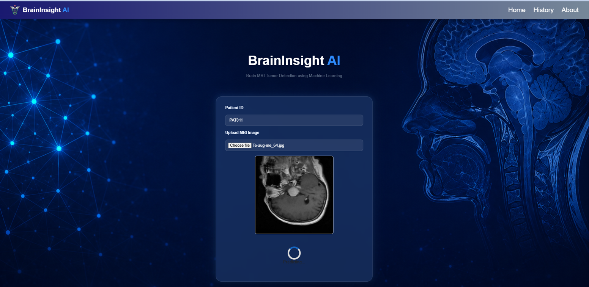
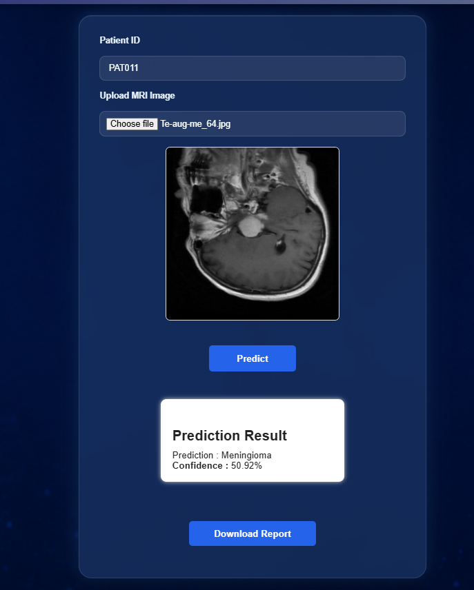
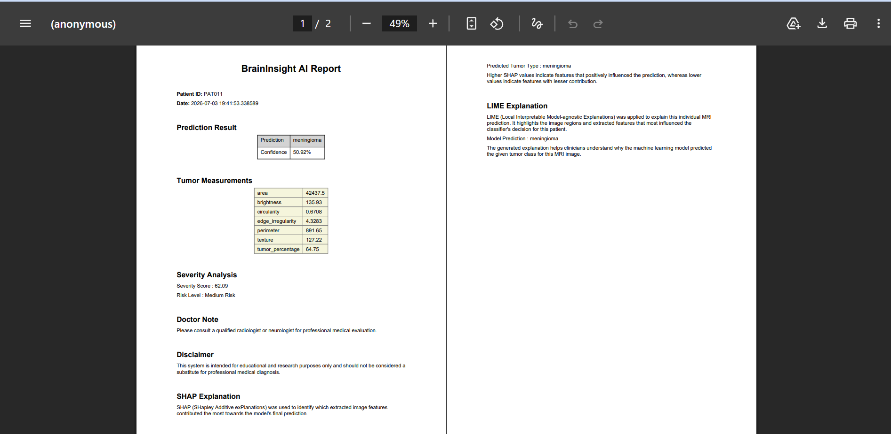
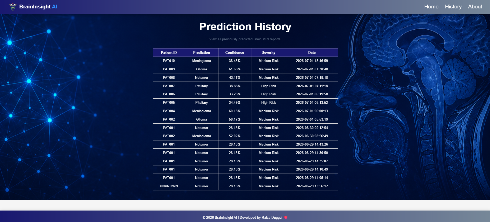
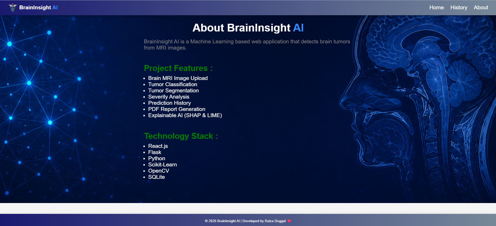

# 1. Introduction

## Overview

**BrainInsight AI** is a full-stack web application that automates the classification of brain MRI scans into multiple tumor categories using classical Machine Learning techniques and Explainable AI (XAI). The system combines image preprocessing, handcrafted feature extraction, tumor segmentation, severity estimation, prediction history, and PDF report generation into a single user-friendly platform.

The application is built with a **React frontend**, **Flask backend**, and a **Machine Learning pipeline** powered by OpenCV, Scikit-learn, XGBoost, SHAP, and LIME.

## Problem It Solves

Brain tumor diagnosis from MRI scans is a time-sensitive and complex process that often requires expert radiological interpretation. Manual analysis can be time-consuming and may vary depending on clinical expertise.

BrainInsight AI assists by:

- Automatically analyzing uploaded MRI images
- Classifying brain tumors into multiple categories
- Highlighting tumor regions through segmentation
- Providing explainable AI visualizations
- Generating downloadable prediction reports
- Maintaining prediction history for future reference

> **Note:** This project is intended for educational and research purposes only and is **not** a substitute for professional medical diagnosis.

## Why This Project is Useful

- Demonstrates a complete end-to-end AI healthcare workflow
- Integrates Machine Learning with a modern web application
- Makes MRI analysis more interactive and understandable using Explainable AI
- Helps students and researchers understand practical deployment of computer vision models
- Provides a scalable architecture that can be extended with Deep Learning models in the future

---

# 2. Live Demo

## Deployment

> **Live Demo:** *Add your deployed application link here*

Example:

```text
https://your-project-url.com
```

## How to Use

1. Open the deployed application.
2. Upload a Brain MRI image.
3. Click the **Predict** button.
4. Wait for the model to process the image.
5. View:
   - Predicted tumor class
   - Confidence score
   - Tumor segmentation
   - Severity analysis
   - SHAP & LIME explanations
6. Download the generated PDF report (if available).
7. View previous predictions from the History page.

---

# 3. Unique Selling Points (USP)

BrainInsight AI goes beyond simple MRI image classification by providing a complete diagnostic support workflow within a single application.

## Key Highlights

- Multi-class Brain MRI tumor classification
- Complete full-stack architecture using React and Flask
- Classical Machine Learning pipeline with handcrafted feature extraction
- Automatic tumor segmentation after prediction
- Severity estimation based on segmented tumor characteristics
- Explainable AI using both **SHAP** and **LIME**
- Automatic PDF report generation
- Prediction history management using SQLite
- Clean and intuitive user interface
- Modular backend architecture for easy scalability

## What Makes It Different?

Unlike many academic projects that only return a predicted class, BrainInsight AI additionally provides:

- Explainable predictions through SHAP and LIME visualizations
- Tumor segmentation for better interpretability
- Severity assessment based on image analysis
- Downloadable clinical-style reports
- Prediction history storage
- Complete end-to-end deployment from frontend to backend

These features make the project closer to a real-world AI-assisted medical imaging system.

---

# 4. Inspiration

Brain tumors are among the most critical neurological conditions where early detection can significantly improve treatment planning and patient outcomes. MRI imaging plays an essential role in diagnosis, but analyzing scans manually requires considerable expertise and time.

The motivation behind BrainInsight AI was to build a complete AI-powered medical imaging application that demonstrates how Machine Learning, Computer Vision, Explainable AI, and Full-Stack Development can work together in a practical healthcare solution.

Rather than focusing only on prediction accuracy, the project emphasizes transparency and usability by integrating tumor segmentation, severity estimation, explainability, report generation, and prediction history into one unified platform.

This project also served as an opportunity to explore the complete lifecycle of an AI application—from dataset preprocessing and feature engineering to model deployment, backend API development, and modern frontend integration—creating a solution that is both educational and representative of real-world AI system design.

# 5. Dataset Used

## Dataset Information

| Attribute | Details |
|----------|---------|
| **Dataset Name** | Brain MRI Images for Brain Tumor Classification |
| **Source** | Kaggle |
| **Dataset Type** | Brain MRI Images |
| **Image Format** | JPG / JPEG / PNG (depending on dataset version) |
| **Classes** | Glioma, Meningioma, Pituitary, No Tumor |

## Dataset Description

The dataset contains labeled Brain MRI scans categorized into four classes representing different tumor conditions and healthy brain images. It is used to train and evaluate the Machine Learning models for multi-class brain tumor classification.

The dataset is divided into **Training** and **Testing** folders, allowing the models to be trained and evaluated on unseen data.

## Dataset Size

| Split | Description |
|-------|-------------|
| **Training** | Brain MRI images for model training |
| **Testing** | Brain MRI images for evaluation |

> Replace this section with the exact number of images if your final dataset changes.

## Class Distribution

- Glioma
- Meningioma
- Pituitary Tumor
- No Tumor

## Dataset Link

**Kaggle Dataset**

https://www.kaggle.com/datasets/masoudnickparvar/brain-tumor-mri-dataset

---

# 6. Features

- Multi-class Brain MRI tumor classification
- MRI image upload through an intuitive web interface
- Automatic image preprocessing pipeline
- Handcrafted feature extraction using Computer Vision techniques
- Tumor segmentation for region visualization
- Severity estimation based on segmentation analysis
- Explainable AI using SHAP visualizations
- Explainable AI using LIME explanations
- Confidence score generation for predictions
- Downloadable PDF report generation
- Prediction history storage using SQLite
- RESTful Flask API architecture
- Responsive React-based frontend
- Modular backend for scalability and maintenance

---

# 7. Working (Tech Stack)

## Frontend

| Technology | Purpose |
|------------|---------|
| React.js | User Interface |
| React Router | Client-side Routing |
| Axios | API Communication |
| CSS | Styling |

---

## Backend

| Technology | Purpose |
|------------|---------|
| Flask | REST API Development |
| Flask-CORS | Cross-Origin Communication |
| Werkzeug | File Upload Handling |
| ReportLab | PDF Report Generation |
| SQLite | Prediction History Storage |

---

## Machine Learning

| Technology | Purpose |
|------------|---------|
| OpenCV | Image Processing |
| Scikit-image | Feature Extraction |
| Scikit-learn | Model Training & Evaluation |
| XGBoost | Gradient Boosting Model |
| NumPy | Numerical Computing |
| Pandas | Data Processing |
| Joblib | Model Serialization |

---

## Explainable AI

| Technology | Purpose |
|------------|---------|
| SHAP | Global & Local Model Interpretation |
| LIME | Local Prediction Explanation |

---

## Computer Vision Pipeline

- Image Loading
- Image Resizing
- Grayscale Conversion
- Histogram Equalization
- Gaussian Blur
- Otsu Thresholding
- Morphological Operations
- Feature Extraction
- Classification
- Tumor Segmentation
- Severity Analysis

---

## Database

| Database | Purpose |
|----------|---------|
| SQLite | Stores Prediction History |

---

## APIs

- Flask REST API
- JSON-based Request & Response
- File Upload API
- Prediction API
- History API
- Report Generation API

---

## Deployment Platform

> Replace with your deployed platform.

Example:

- Render
- Railway
- Azure
- AWS
- Vercel (Frontend)

---

## Development Tools

- Python
- Jupyter Notebook
- VS Code
- Git
- GitHub
- npm
- Postman

---

# 8. Models Used & Performance

## Models Experimented

The project evaluates multiple classical Machine Learning algorithms for Brain MRI tumor classification.

| Model | Why It Was Considered |
|--------|-----------------------|
| Decision Tree | Simple baseline classifier with fast inference |
| K-Nearest Neighbors (KNN) | Distance-based classification for image features |
| Random Forest | Ensemble model with improved robustness and accuracy |
| XGBoost | Gradient Boosting model capable of learning complex patterns |

---

## Model Performance

| Model | Accuracy | Precision | Recall | F1-Score |
|--------|---------:|----------:|--------:|----------:|
| Random Forest | **82.01%** | **82.23%** | **82.01%** | **81.84%** |
| XGBoost | 81.46% | 81.26% | 81.46% | 81.23% |
| Decision Tree | 70.00% | 70.06% | 70.00% | 70.02% |
| KNN | 69.03% | 73.43% | 69.03% | 68.90% |

---

## Final Selected Model

### Random Forest Classifier

### Why Random Forest?

The Random Forest model was selected as the final classifier because it achieved the best overall performance across all evaluation metrics.

Advantages include:

- Highest overall accuracy
- Better generalization on unseen MRI images
- Reduced overfitting through ensemble learning
- Stable performance across multiple tumor classes
- Fast prediction during deployment
- Reliable integration with the handcrafted feature extraction pipeline

The trained Random Forest model is serialized using **Joblib** and deployed within the Flask backend to perform real-time Brain MRI tumor classification.

# 9. Backend API Documentation

The backend is built using **Flask REST APIs** that handle image uploads, tumor prediction, prediction history management, and report generation.

---

## API Overview

| Endpoint | Method | Purpose |
|----------|--------|---------|
| `/upload` | POST | Upload a Brain MRI image |
| `/predict` | POST | Perform tumor prediction, segmentation, severity analysis, and explainability |
| `/history` | GET | Retrieve all prediction history |
| `/history/<id>` | GET | Retrieve a specific prediction record |
| `/history` | DELETE | Clear prediction history |
| `/report` | POST | Generate and download a PDF report |
| `/health` | GET | Check backend server status |

---

## 1. Upload MRI Image

| Field | Details |
|--------|---------|
| **Endpoint** | `/upload` |
| **Method** | `POST` |
| **Purpose** | Upload an MRI image before prediction |

### Request Body

| Parameter | Type | Required |
|------------|------|----------|
| image | File | ✅ |

### Example Request

```http
POST /upload
Content-Type: multipart/form-data
```

### Example Response

```json
{
    "message": "Image uploaded successfully",
    "filename": "brain_mri.jpg"
}
```

---

## 2. Predict Brain Tumor

| Field | Details |
|--------|---------|
| **Endpoint** | `/predict` |
| **Method** | `POST` |
| **Purpose** | Predict tumor class and generate all analysis results |

### Request Body

| Parameter | Type | Required |
|------------|------|----------|
| image | File | ✅ |
| patient_id | String | Optional |

### Example Request

```http
POST /predict
Content-Type: multipart/form-data
```

### Example Response

```json
{
  "prediction": "Glioma",
  "confidence": 0.92,
  "severity": "High",
  "segmentation": "generated",
  "shap": "generated",
  "lime": "generated",
  "report": "available"
}
```

---

## 3. Prediction History

| Field | Details |
|--------|---------|
| **Endpoint** | `/history` |
| **Method** | `GET` |
| **Purpose** | Fetch all previous predictions |

### Example Response

```json
[
  {
    "patient_id": "P101",
    "prediction": "Pituitary",
    "confidence": 0.95
  }
]
```

---

## 4. Retrieve Specific Prediction

| Field | Details |
|--------|---------|
| **Endpoint** | `/history/<id>` |
| **Method** | `GET` |
| **Purpose** | Retrieve one prediction record |

---

## 5. Delete Prediction History

| Field | Details |
|--------|---------|
| **Endpoint** | `/history` |
| **Method** | `DELETE` |
| **Purpose** | Delete all stored prediction history |

### Example Response

```json
{
    "message":"History cleared successfully"
}
```

---

## 6. Generate PDF Report

| Field | Details |
|--------|---------|
| **Endpoint** | `/report` |
| **Method** | `POST` |
| **Purpose** | Generate a downloadable PDF report |

### Response

```text
BrainInsight_Report.pdf
```

---

## 7. Health Check

| Field | Details |
|--------|---------|
| **Endpoint** | `/health` |
| **Method** | `GET` |
| **Purpose** | Verify backend availability |

### Example Response

```json
{
    "status":"Running"
}
```

---

# 10. Complete System Design & Workflow

## Overall Workflow

BrainInsight AI follows an end-to-end Machine Learning pipeline that integrates image processing, feature engineering, model inference, explainable AI, and report generation into a seamless web application.

---

## User Flow

```text
User
   │
   ▼
Open Website
   │
   ▼
Upload MRI Image
   │
   ▼
Click Predict
   │
   ▼
View Prediction
   │
   ▼
Download Report
   │
   ▼
View Prediction History
```

---

## Frontend Flow

```text
React UI

↓

UploadForm Component

↓

Axios API Request

↓

Flask Backend

↓

Receive JSON Response

↓

Display Prediction Card

↓

Generate Report

↓

History Page
```

---

## Backend Flow

```text
API Request

↓

Validate Image

↓

Store Uploaded Image

↓

Preprocessing

↓

Feature Extraction

↓

Load Trained Model

↓

Prediction

↓

Segmentation

↓

Severity Analysis

↓

SHAP & LIME

↓

Store History (SQLite)

↓

Return JSON Response
```

---

## Machine Learning Pipeline

```text
MRI Image

↓

Image Preprocessing

↓

Resize Image

↓

Grayscale Conversion

↓

Histogram Equalization

↓

Gaussian Blur

↓

Thresholding

↓

Morphological Operations

↓

Feature Extraction
(HOG + LBP + GLCM + Hu Moments + Texture Features)

↓

Feature Scaling

↓

Random Forest Classifier

↓

Tumor Prediction

↓

Confidence Score

↓

Segmentation

↓

Severity Analysis

↓

SHAP Explanation

↓

LIME Explanation

↓

Generate PDF Report
```

---

## Prediction Flow

```text
User Upload

↓

Image Validation

↓

Preprocessing

↓

Feature Extraction

↓

Random Forest Prediction

↓

Confidence Calculation

↓

Display Result
```

---

## Response Generation

The backend returns a structured JSON response containing:

- Predicted Tumor Class
- Prediction Confidence
- Segmentation Result
- Severity Analysis
- SHAP Visualization
- LIME Visualization
- Report Generation Status

---

## Overall Architecture



---

## Complete Workflow Diagram



---

# 11. Images & Output Screenshots

> Replace the placeholder paths below with your actual screenshots after adding them to the repository.

## Home Page

```md


```

---

## Prediction Output

```md



```

---

## PDF Report

```md

```

---

## Prediction History

```md

```

---

## About Page 

```md

```
